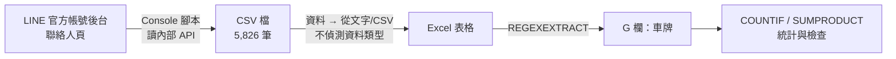
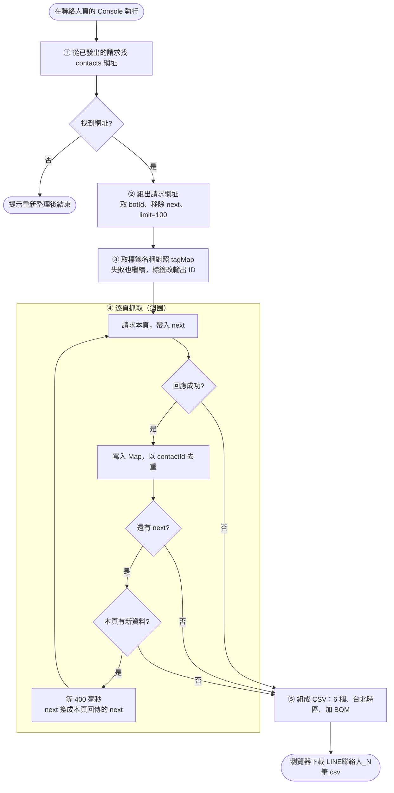
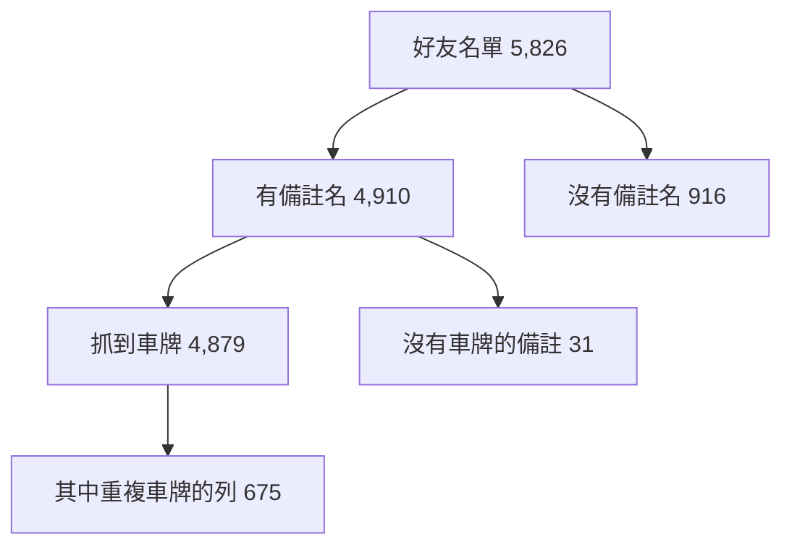

# LINE 聯絡人匯出：流程、程式碼與 Excel 公式說明

> 最後整理：2026-10-01
> 這份文件可直接編輯。流程圖用 Mermaid 語法寫成，在 VS Code（需 Markdown Preview Mermaid 外掛）、Obsidian、Typora、GitHub 都能顯示成圖。想改流程，直接改文字即可。

## 目錄

1. [整體流程](#1-整體流程)
2. [Console 腳本：流程與完整程式碼](#2-console-腳本流程與完整程式碼)
3. [在 Excel 開啟 CSV](#3-在-excel-開啟-csv)
4. [Excel 公式說明](#4-excel-公式說明)
5. [統計結果與對帳](#5-統計結果與對帳)
6. [遇到的問題與修正](#6-遇到的問題與修正)
7. [附錄：之後比對用的公式](#7-附錄之後比對用的公式)

---

## 1. 整體流程



| 階段 | 做什麼 | 工具 |
|---|---|---|
| 取得資料 | 讀取後台聯絡人頁使用的內部 API，翻完全部頁 | 瀏覽器 Console |
| 開啟檔案 | 以文字格式匯入，避免開頭的 0 被移除 | Excel 資料匯入 |
| 抽出車牌 | 從備註名中用規則挖出車牌 | `REGEXEXTRACT` |
| 檢查 | 計算筆數、重複、非好友 | `COUNTIF`、`SUMPRODUCT` |

### 為什麼讀內部 API，不用官方 API 或解析畫面

| 做法 | 能拿到備註名嗎 | 結論 |
|---|---|---|
| 官方 Messaging API `GET /v2/bot/followers/ids` | 不能，只有 UID | 只適合核對 UID 總數 |
| 解析畫面（scroll、querySelector） | 理論上可以 | 聯絡人頁是每頁 20 筆的分頁清單，不是無限捲動，容易失敗 |
| 後台內部 API `/api/v2/bots/{id}/contacts` | 可以，在 `profile.nickname` | **採用** |

內部 API 每筆回傳的重要欄位：

| 欄位 | 意義 | 對應 CSV 欄 |
|---|---|---|
| `contactId` | LINE UID | UID |
| `profile.name` | 好友自己的 LINE 名稱 | LINE名稱 |
| `profile.nickname` | 你手動改的備註名（含車牌） | 備註名(車牌) |
| `tagIds` | 聊天標籤的 ID 清單 | 標籤 |
| `friend` | 是否仍是好友 | 是否好友 |
| `lastTalkedAt` | 最後聊天時間（毫秒時間戳） | 最後聊天時間 |
| `next`（在 list 之外） | 下一頁的翻頁碼 | 不輸出，只用來翻頁 |

---

## 2. Console 腳本：流程與完整程式碼

### 執行方式

1. 登入 `chat.line.biz`，進入「聯絡人」頁，等清單載入完。
2. 按 F12，切到 Console。
3. 如果貼上被擋，先輸入 `allow pasting` 按 Enter。
4. 貼上下方程式碼，按 Enter。約 1 分鐘後瀏覽器會自動下載 CSV。

### 流程圖



三個條件會讓迴圈停止：回應失敗、沒有 `next`、這一頁沒有新資料。停止後都會繼續輸出已抓到的資料。

### 完整程式碼

```js
(async () => {
  const sleep = ms => new Promise(r => setTimeout(r, ms));

  // 1. 從頁面已發出的請求找出 contacts 網址
  const found = performance.getEntriesByType('resource')
    .map(e => e.name).filter(n => /\/api\/v2\/bots\/[^/]+\/contacts\?/.test(n)).pop();
  if (!found) { console.log('找不到 contacts 網址，請重新整理頁面後再執行'); return; }

  const base = new URL(found);
  const botId = base.pathname.match(/\/bots\/([^/]+)\//)[1];
  base.searchParams.delete('next');
  base.searchParams.set('limit', '100');   // 若出現錯誤，改回 '20'

  // 2. 嘗試取得標籤名稱對照（失敗也沒關係，會改輸出標籤 ID）
  const tagMap = {};
  try {
    const t = await (await fetch(`https://chat.line.biz/api/v1/bots/${botId}/tags`, { credentials: 'include' })).json();
    (Array.isArray(t) ? t : t.list || []).forEach(x => { tagMap[x.tagId || x.id] = x.name; });
    console.log('標籤對照筆數：', Object.keys(tagMap).length);
  } catch (e) { console.log('標籤名稱取得失敗，將輸出標籤 ID'); }

  // 3. 逐頁抓取
  const all = new Map();
  let next = null, page = 0;
  while (true) {
    const u = new URL(base);
    if (next) u.searchParams.set('next', next);
    const res = await fetch(u, { credentials: 'include' });
    if (!res.ok) { console.log('請求失敗', res.status, '，已抓到', all.size, '筆'); break; }
    const j = await res.json();
    const before = all.size;
    (j.list || []).forEach(c => all.set(c.contactId, c));
    page++;
    console.log(`第 ${page} 頁，累計 ${all.size} 筆`);
    if (!j.next) { console.log('已到最後一頁'); break; }
    if (all.size === before) { console.log('這頁沒有新資料，翻頁參數可能不對，已停止'); break; }
    next = j.next;
    await sleep(400);
  }

  // 4. 輸出 CSV
  const fmt = ms => ms ? new Date(ms).toLocaleString('sv-SE', { timeZone: 'Asia/Taipei' }) : '';
  const esc = v => `"${String(v ?? '').replace(/"/g, '""')}"`;
  const head = ['UID', 'LINE名稱', '備註名(車牌)', '標籤', '是否好友', '最後聊天時間'];
  const lines = [...all.values()].map(c => [
    c.contactId,
    c.profile?.name,
    c.profile?.nickname,
    (c.tagIds || []).map(id => tagMap[id] || id).join(' | '),
    c.friend ? 'Y' : 'N',
    fmt(c.lastTalkedAt)
  ].map(esc).join(','));
  const csv = '' + head.join(',') + '\n' + lines.join('\n');

  const a = document.createElement('a');
  a.href = URL.createObjectURL(new Blob([csv], { type: 'text/csv;charset=utf-8;' }));
  a.download = `LINE聯絡人_${all.size}筆.csv`;
  document.body.appendChild(a); a.click(); a.remove();
  console.log('完成，共', all.size, '筆');
})();
```

### 程式碼逐段說明

| 區段 | 做什麼 | 重點 |
|---|---|---|
| 1 找網址 | `performance.getEntriesByType('resource')` 列出頁面已發出的所有請求，用正規表達式挑出 `/api/v2/bots/{id}/contacts?` 那一條，取最後一筆 | 不必手動填帳號 ID。找不到時通常是頁面還沒載入完 |
| 組網址 | 取出 `botId`，刪掉舊的 `next`，把 `limit` 設成 100 | 若 100 被拒絕（狀態 400），改回 `'20'` |
| 2 標籤對照 | 呼叫 `/api/v1/bots/{botId}/tags`，把 `tagId` 對到標籤名稱，存進 `tagMap` | 失敗不影響主流程，標籤欄會顯示 ID 代碼 |
| 3 逐頁抓取 | 用 `while(true)` 迴圈，每次帶上一頁回傳的 `next` 請求下一頁 | `credentials: 'include'` 讓請求帶上你的登入狀態 |
| `Map` 去重 | 以 `contactId` 當鍵，重複的 UID 會被覆蓋而不是加倍 | 也用來判斷「這頁有沒有新資料」 |
| `sleep(400)` | 每頁間隔 0.4 秒 | 避免請求太密被限流 |
| 4 輸出 CSV | 時間用 `sv-SE` 格式輸出 `2026-09-14 20:35:53`，指定台北時區 | 毫秒時間戳轉成可讀日期 |
| `esc` | 每個欄位前後加雙引號，內容裡的雙引號改成兩個 | 備註名含逗號、引號時不會讓欄位錯位 |
| `''` | 檔案開頭的 BOM | 讓 Excel 正確顯示中文，不會亂碼 |

這支腳本只讀取，不會修改你的 LINE 帳號。

---

## 3. 在 Excel 開啟 CSV

**不要雙擊 CSV。** 雙擊會觸發兩個問題：

| 現象 | 原因 |
|---|---|
| 跳出「移除前置的零」 | Excel 把像數字的內容轉成數字，`003-宋昊誠` 之類的備註會被改掉 |
| 備註名顯示 `#NAME?` | 內容開頭是 `=`、`+`、`-` 時被當成公式 |

**正確做法：**

1. 開一個空白活頁簿。
2. 資料 → 從文字/CSV。
3. 選檔案，在預覽視窗把「資料類型偵測」選為 **不要偵測資料類型**。
4. 載入。

若已經雙擊開了，跳出視窗時選「不轉換」。

載入後 Excel 會把資料放進「表格」，欄名自動變成 `Column1`、`Column2`…，原本的標題列會變成第 2 列資料。所以資料範圍是 **第 3 列到第 5828 列**（5,826 筆）。

| 欄 | 欄名 | 內容 |
|---|---|---|
| A | Column1 | UID |
| B | Column2 | LINE名稱 |
| C | Column3 | 備註名（含車牌） |
| D | Column4 | 標籤 |
| E | Column5 | 是否好友（Y 或 N） |
| F | Column6 | 最後聊天時間 |
| G | 車牌 | 自己新增，放公式 |

---

## 4. Excel 公式說明

> 範圍寫法說明：下面統一用 `$3:$5828`。若你的資料列數不同，請改成實際的最後一列。
> 先前對話中有些公式寫成 `5827`，會漏掉最後一列。這次的結果不受影響，因為最後一列剛好沒有備註名，但建議改成 `5828`。

### 4.1 公式總覽

| # | 用途 | 公式 | 結果 |
|---|---|---|---|
| 1 | 抽出車牌（放 G 欄） | `=IFERROR(UPPER(SUBSTITUTE(SUBSTITUTE(REGEXEXTRACT([@Column3],"[A-Za-z]{2,3}[ -]*[0-9]{3,4}\|[0-9]{3,4}[ -]*[A-Za-z]{2,3}")," ",""),"-","")),"")` | 每列一個車牌 |
| 2 | 有備註名筆數 | `=SUMPRODUCT(--(LEN($C$3:$C$5828)>0))` | 4910 |
| 3 | 抓到車牌筆數 | `=SUMPRODUCT(--(LEN($G$3:$G$5828)>0))` | 4879 |
| 4 | 有備註但沒車牌 | `=COUNTIFS($C$3:$C$5828,"?*",$G$3:$G$5828,"")` | 31 |
| 5 | 非好友 | `=COUNTIF($E$3:$E$5828,"N")` | 7 |
| 6 | 重複車牌（共用帳號）的列數 | `=SUMPRODUCT(--(COUNTIF($G$3:$G$5828,$G$3:$G$5828)>1)*(LEN($G$3:$G$5828)>0))` | 675 |

下面逐條說明。

### 4.2 公式 1：抽出車牌

放在 G 欄第一列資料，表格會自動填滿整欄。

```excel
=IFERROR(
  UPPER(
    SUBSTITUTE(
      SUBSTITUTE(
        REGEXEXTRACT([@Column3],"[A-Za-z]{2,3}[ -]*[0-9]{3,4}|[0-9]{3,4}[ -]*[A-Za-z]{2,3}")
      ," ","")
    ,"-","")
  )
,"")
```

由內向外拆解：

| 層 | 函數 | 作用 |
|---|---|---|
| 最內 | `REGEXEXTRACT(文字, 規則)` | 用正規表達式，從文字中取出**第一個**符合的片段。找不到時回傳 `#N/A` |
| 第二層 | `SUBSTITUTE(…," ","")` | 把空格拿掉 |
| 第三層 | `SUBSTITUTE(…,"-","")` | 把橫線拿掉，所以 `BUH -3130` 會變成 `BUH3130` |
| 第四層 | `UPPER(…)` | 轉大寫，避免大小寫不同造成比對不到 |
| 最外 | `IFERROR(…,"")` | 找不到車牌時顯示空白，不顯示錯誤 |

正規表達式拆解：

| 片段 | 意思 |
|---|---|
| `[A-Za-z]{2,3}` | 2 到 3 個英文字母 |
| `[ -]*` | 中間可以有 0 個以上的空格或橫線 |
| `[0-9]{3,4}` | 3 到 4 個數字 |
| 中間的直線 `\|`（反斜線只是為了不破壞這個表格，Excel 裡打的是單純的 `\|` 去掉反斜線，即一條直線） | 「或」。左邊是新式車牌 `ABC-1234`，右邊是舊式 `1234-AB` |

範例：

| 備註名 | 結果 |
|---|---|
| `!$! 陳建祥/CAD0990(中壢)` | `CAD0990` |
| `-Awin/CBE0955` | `CBE0955` |
| `昱/BUH -3130` | `BUH3130` |
| `邱和松Matt/BUV787` | `BUV787` |
| `Yi Teng/阿慈車庫(八德)` | （空白，沒有車牌） |

> 注意：`REGEXEXTRACT` 是 Microsoft 365 較新版本才有的函數，名稱是 `REGEXEXTRACT`（中間有兩個 E，先前給的 `REGEXTRACT` 是拼錯的）。若你的 Excel 出現 `#NAME?`，要改用 Power Query。
> 規則放寬為 3 到 4 位數字後，可能誤抓到像 `Eason1234` 這種英文名加數字的內容。

**非表格版本**：若資料不在表格內，把 `[@Column3]` 改成 `C3`，再往下填滿。

**寫法的演進（對話中修過兩次）：**

| 版本 | 寫法 | 問題 |
|---|---|---|
| v1 | 規則 `[A-Za-z]{2,3}-?[0-9]{4}\|[0-9]{4}-?[A-Za-z]{2,3}` | 漏掉 3 位數字車牌（`EPB620`）和橫線旁有空格的（`BUH -3130`） |
| v1 的位置錯誤 | G3 寫成讀 `C2` | 整欄錯位一列，車牌跑到下一列 |
| v2（目前） | 規則放寬，用 `[@Column3]` 讀同一列 | 解決上述問題 |

### 4.3 公式 2、3：`SUMPRODUCT(--(LEN(範圍)>0))`

```excel
=SUMPRODUCT(--(LEN($C$3:$C$5828)>0))
```

| 部分 | 作用 |
|---|---|
| `LEN($C$3:$C$5828)` | 對範圍內**每一格**算字數，得到一整串數字，例如 `{24,0,0,18,…}` |
| `>0` | 每個字數是否大於 0，得到 `TRUE` 或 `FALSE` |
| `--` | 兩個負號，把 `TRUE/FALSE` 轉成 `1/0`（第一個負號轉成 -1/0，第二個轉回 1/0） |
| `SUMPRODUCT(…)` | 把所有 1 加總，也就是「字數大於 0 的格子數」 |

意思是：**這個範圍裡有多少格不是空白。**

用在兩個欄位：

| 套用欄 | 意義 | 結果 |
|---|---|---|
| C 欄（備註名） | 有備註名的人數 | 4910 |
| G 欄（車牌） | 成功抓到車牌的人數 | 4879 |

為什麼不用 `COUNTA`：公式回傳的空白 `""` 也會被 `COUNTA` 算成有內容，數字會偏大。`LEN` 把空白字串算成 0，所以正確。

### 4.4 公式 4：有備註名但沒抓到車牌

```excel
=COUNTIFS($C$3:$C$5828,"?*",$G$3:$G$5828,"")
```

| 部分 | 作用 |
|---|---|
| `$C$3:$C$5828,"?*"` | C 欄「至少有一個字」。萬用字元 `?` 代表恰好一個任意字元，`*` 代表任意長度，合起來是「長度 ≥ 1」 |
| `$G$3:$G$5828,""` | G 欄是空白（包含公式回傳的空字串） |
| `COUNTIFS` | 兩個條件**同時成立**才計數 |

結果 31，等於 4910 − 4879。這 31 筆是備註名裡沒有車牌格式的人（例如只寫了名字、業務暱稱、同業店名）。

### 4.5 公式 5：非好友

```excel
=COUNTIF($E$3:$E$5828,"N")
```

E 欄是腳本輸出的「是否好友」，`Y` 是好友，`N` 是已封鎖或已退出。算出 N 的筆數，結果是 7。這些人不能發送訊息，之後要排除。

### 4.6 公式 6：重複車牌（共用帳號）

```excel
=SUMPRODUCT(--(COUNTIF($G$3:$G$5828,$G$3:$G$5828)>1)*(LEN($G$3:$G$5828)>0))
```

| 部分 | 作用 |
|---|---|
| `COUNTIF($G$3:$G$5828,$G$3:$G$5828)` | 第二個參數放整個範圍，會對**每一格的車牌**各算一次「這個車牌在整欄出現幾次」，得到一串次數 |
| `>1` | 出現超過 1 次，代表這個車牌有不只一個人在用 |
| `*(LEN(…)>0)` | 乘上「不是空白」。因為空白格彼此「相同」，不排除的話幾千個空白都會被算成重複 |
| `--` 與 `SUMPRODUCT` | 轉成 1/0 後加總 |

**結果是「列數」，不是「車牌數」。** 675 代表有 675 位好友的車牌和別人重複。實際重複的車牌數約 336 個，因為一個車牌通常對應兩個以上的 UID。

常見原因：夫妻各加一個帳號、同一個人兩個 LINE 帳號、備註名誤填。是否要去重，等到發優惠券時再決定。

**補充：標出哪些列重複**（新增的輔助欄，之前沒用過）：

```excel
=IF(AND([@車牌]<>"",COUNTIF([車牌],[@車牌])>1),"重複","")
```

放在 H 欄，之後可以篩選「重複」逐筆檢視。

> 效能提醒：公式 6 要做約 5,800 × 5,800 次比對，在一般電腦上需要幾秒，這是正常的。

### 4.7 絕對參照 `$`：為什麼統計公式會出錯

對話中曾出現統計數字一路遞減（4875、4874、4873…）。原因有兩個：

| 原因 | 說明 |
|---|---|
| 範圍沒鎖 | `C2:C5828` 往下填時，每一列的範圍都跟著下移一格 |
| 放在表格裡 | 表格會把新公式自動填滿整欄，於是每列各算一次 |

| 寫法 | 向下填時 |
|---|---|
| `C2:C5828`（相對） | 變成 `C3:C5829`、`C4:C5830`… |
| `$C$2:$C$5828`（絕對） | 永遠是 `C2:C5828` |
| `[@Column3]`（表格結構化參照） | 永遠指向同一列的 Column3 |

**做法：** 統計公式要用 `$` 鎖定範圍，並且放在表格外、與表格至少隔一欄的空白處。

---

## 5. 統計結果與對帳

| 項目 | 筆數 | 對應公式 |
|---|---|---|
| LINE 好友名單 | 5,826 | 腳本輸出筆數 |
| 有備註名 | **4,910** | 公式 2 |
| 其中抓到車牌 | **4,879** | 公式 3 |
| 沒有車牌的備註 | **31** | 公式 4 |
| 非好友 | **7** | 公式 5 |
| 重複（共用帳號） | **675** | 公式 6 |
| 沒有備註名 | 916 | 5,826 − 4,910 |

對帳：



- 4,910 = 4,879 + 31
- 5,826 = 4,910 + 916

---

## 6. 遇到的問題與修正

| 現象 | 原因 | 修正 |
|---|---|---|
| Gemini 的腳本抓不到資料 | 猜頁面結構；聯絡人頁是分頁，不是無限捲動 | 改讀內部 API |
| Console 不讓貼上程式 | 瀏覽器的貼上保護 | 先輸入 `allow pasting` |
| Excel 跳出「移除前置的零」 | CSV 預設會轉換數字 | 選「不轉換」，或改用「從文字/CSV」匯入 |
| 備註名顯示 `#NAME?` | 內容開頭是 `=`、`+`、`-` | 用匯入方式，欄位當純文字 |
| 儲存格顯示 `########` | 欄寬不足 | 拉寬欄位，資料沒壞 |
| 函數 `REGEXTRACT` 出現 `#NAME?` | 函數名稱拼錯 | 改成 `REGEXEXTRACT` |
| 統計數字逐列遞減 | 範圍沒加 `$`，公式放在表格內被自動填滿 | 用絕對範圍，放在表格外隔一欄 |
| 車牌欄整欄錯位一列 | 公式讀 `C2`，不是同一列 | 表格內改用 `[@Column3]` |
| 漏抓 `EPB620`、`BUH -3130` | 規則要求 4 位數字，且不允許空格 | 放寬為 3 到 4 位，橫線前後可有空格 |
| 第 2 列是標題文字，被當成資料 | 標題列沒被辨識，欄名變成 Column1… | 統計範圍從第 3 列開始 |

---

## 7. 附錄：之後比對用的公式

若之後要把 LINE 名單與另一份車牌清單（例如客戶資料匯出表）比對，會用到下列公式。這些是先前對話中提過的，尚未納入上面的統計結果。

### 7.1 統一車牌格式

```excel
=UPPER(SUBSTITUTE(SUBSTITUTE(TRIM([@車牌]),"-","")," ",""))
```

| 部分 | 作用 |
|---|---|
| `TRIM` | 去掉前後多餘空白 |
| 兩層 `SUBSTITUTE` | 去掉橫線與空格 |
| `UPPER` | 轉大寫 |

兩邊都轉成同樣格式（例如 `CAD0990`），比對才不會因為 `CAD-0990` 與 `CAD0990` 不同而失敗。

### 7.2 以車牌查對應資料

```excel
=IF(G2="","",XLOOKUP(G2,對方表!$H:$H,對方表!$C:$C,"查無"))
```

| 參數 | 意思 |
|---|---|
| `G2` | 要找的車牌 |
| `對方表!$H:$H` | 去哪一欄找（對方表的車牌 key 欄） |
| `對方表!$C:$C` | 找到後回傳哪一欄（例如客戶姓名） |
| `"查無"` | 找不到時顯示的文字 |
| 最外層 `IF(G2="","",…)` | 沒有車牌的人直接留白，不去查 |

> 欄位字母請依你的實際工作表調整。

### 7.3 分類標示

```excel
=IF(E2<>"Y","排除-非好友",IF(G2="","未確認-無車牌",IF(H2="查無","B-有車牌但查無","A-已比對")))
```

由外向內依序判斷：先排除非好友，再看有沒有車牌，再看有沒有查到。四種結果互斥，每一列只會落在其中一類。

---

## 資料安全提醒

- CSV 內有客戶姓名、LINE UID 與車牌，請勿整份貼到外部服務或社群。
- 向他人求助時，只貼 2 到 3 列範例，並改掉姓名與車牌。
- 貼出網址或標頭前，先刪掉 Cookie、Authorization、`x-xsrf-token`。
